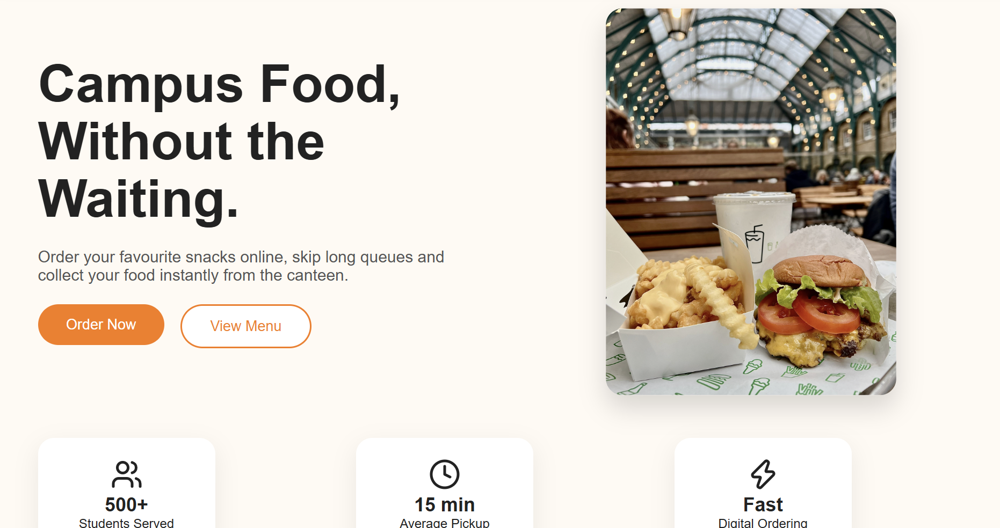
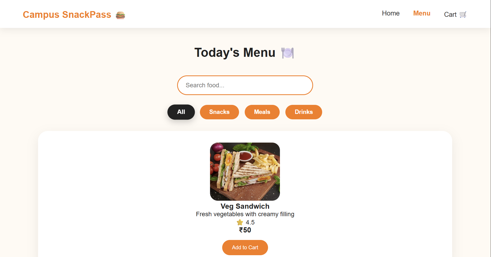
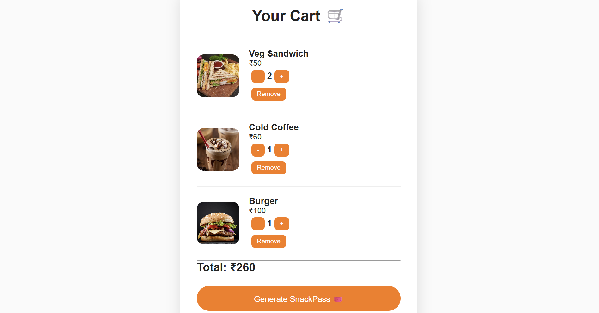
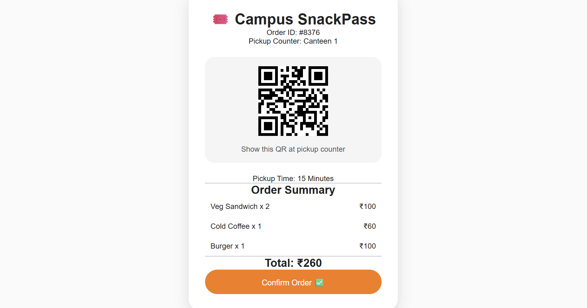
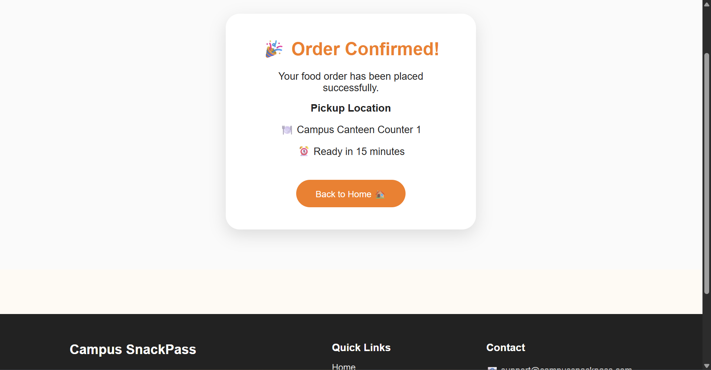

# Campus SnackPass 🍔

Campus SnackPass is a modern React-based web application that enables students to order food online and collect it from the campus canteen without waiting in long queues. The application provides a simple, responsive, and user-friendly ordering experience across desktop and mobile devices.

---

## 🌐 Live Demo

**Website:** https://campus-snackpass-ashen.vercel.app

---

## 📖 About the Project

Waiting in long queues during college breaks can waste valuable time. Campus SnackPass was built to provide a faster and more convenient food ordering experience for students.

Users can:

- Browse the campus menu
- Search for food items
- Filter food by category
- Add items to the shopping cart
- Manage cart quantities
- Generate a digital SnackPass after placing an order

The project focuses on responsive UI design, React state management, and modern frontend development practices.

---

## ✨ Features

- Responsive homepage
- Interactive food menu
- Search functionality
- Category filtering
- Shopping cart using Context API
- Quantity management
- Automatic price calculation
- Digital SnackPass generation
- Order confirmation page
- Toast notifications
- Smooth animations using Framer Motion
- Mobile-friendly design

---

## 🛠️ Tech Stack

### Frontend

- React
- React Router DOM
- Context API
- CSS3
- Framer Motion
- React Toastify
- Lucide React Icons

### Development Tools

- Vite
- ESLint
- Git
- GitHub
- VS Code

### Deployment

- Vercel

---

## 📂 Project Structure

```text
campus-snackpass/
│
├── public/
├── src/
│   ├── assets/
│   ├── components/
│   ├── context/
│   ├── pages/
│   ├── App.jsx
│   ├── main.jsx
│   └── index.css
│
├── package.json
├── vite.config.js
└── README.md
```

---

## 🚀 Getting Started

### Prerequisites

Make sure the following are installed:

- Node.js
- npm
- Git

---

### Clone the Repository

```bash
git clone https://github.com/Mithra-dev17/campus-snackpass
```

---

### Navigate to the Project

```bash
cd campus-snackpass
```

---

### Install Dependencies

```bash
npm install
```

---

### Start the Development Server

```bash
npm run dev
```

The application will be available at:

```
http://localhost:5173
```

---

## 📦 Production Build

```bash
npm run build
```

---

## 🔍 Run ESLint

```bash
npm run lint
```

---

## 📱 Screenshots

### Home Page



### Menu Page



### Shopping Cart



### Digital SnackPass



### Order Success



> 

---

## 🎯 Future Enhancements

- User authentication
- Admin dashboard
- Backend integration
- Online payment gateway
- Order history
- Dark mode
- Favorite food items
- Real-time order tracking
- Push notifications

---

## 📚 What I Learned

This project helped me gain practical experience with:

- React component architecture
- React Router
- Context API
- State management
- Responsive web design
- Git and GitHub workflow
- Vercel deployment
- Modern frontend project structure

---

## Documentation

- [Prompt Report (DOCX)](documentation/ACE_Campus_SnackPass_Prompt_Report_v2.docx)

## 👩‍💻 Author

**Mithra Senthilkumaran**

GitHub: https://github.com/Mithra-dev17
LinkedIn: https://www.linkedin.com/in/mithra-senthilkumaran-946b46375
---

## 📄 License

This project is created for learning and portfolio purposes.